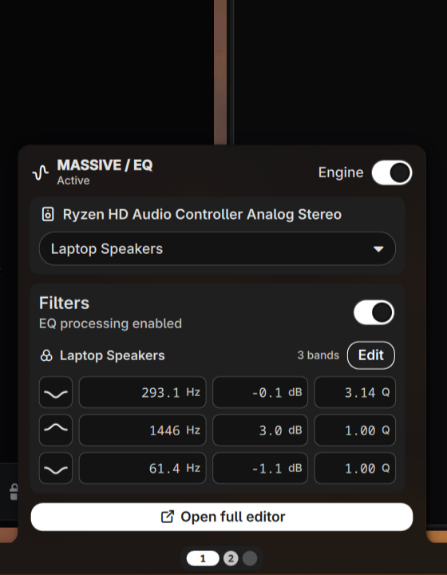
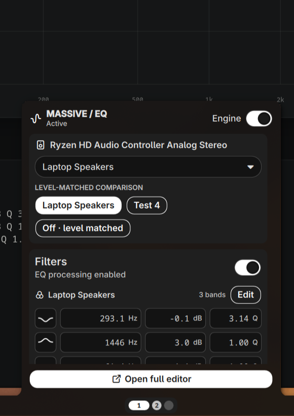
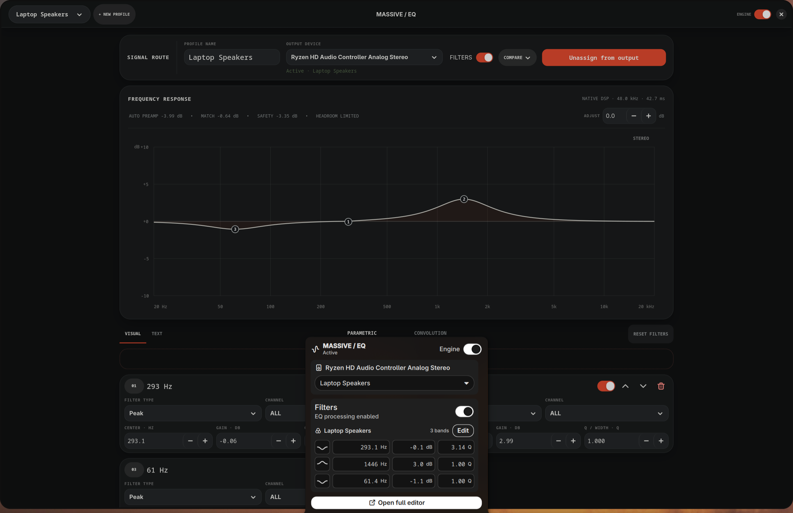
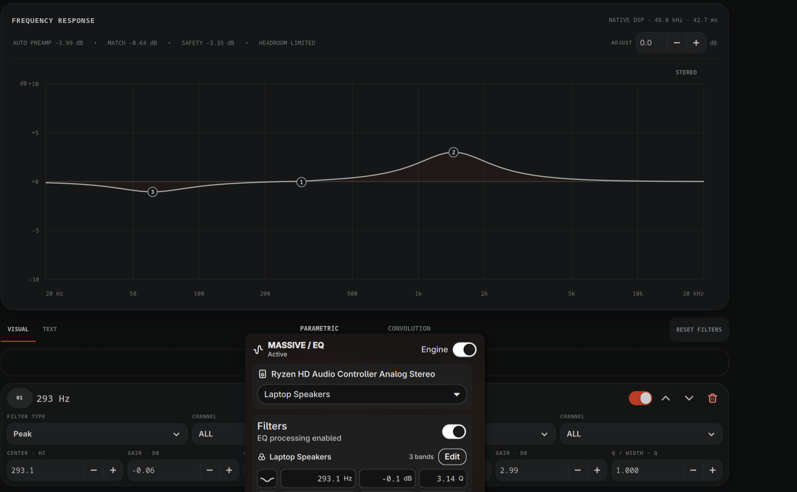
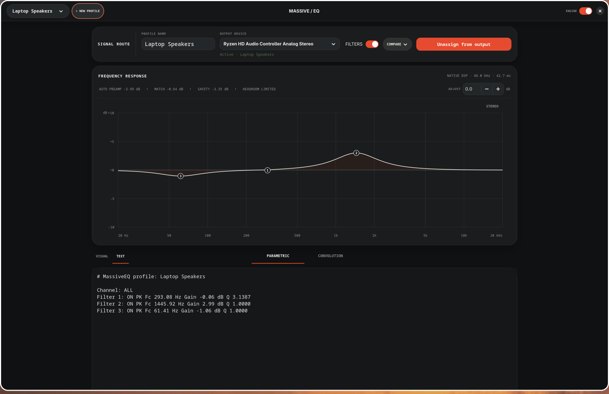
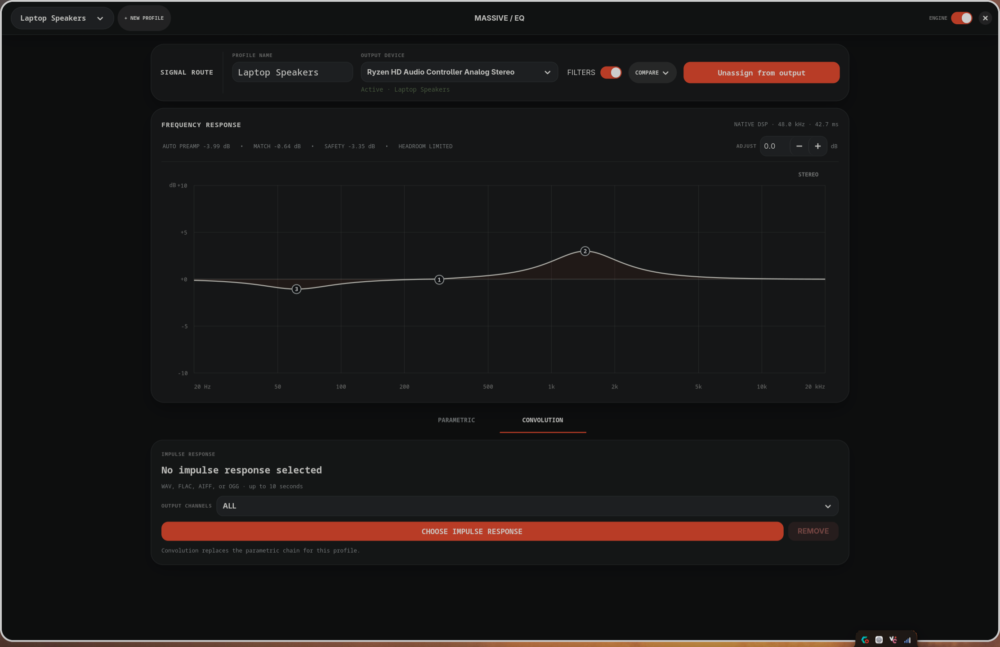
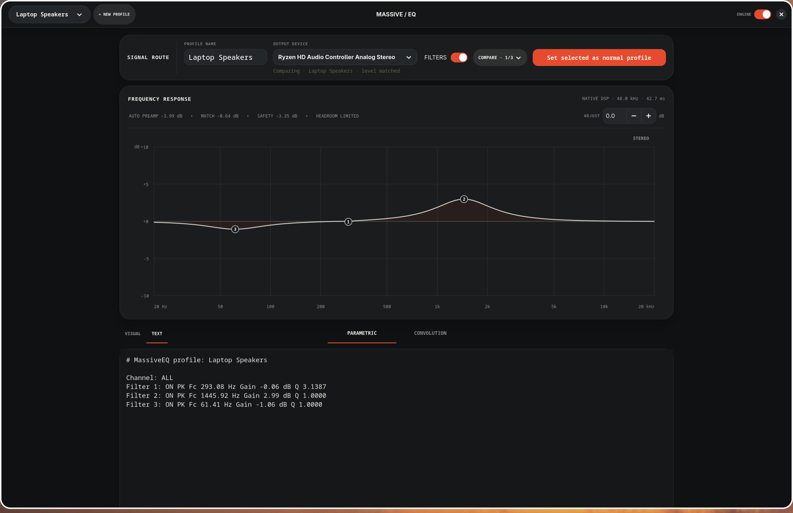
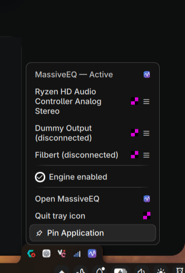

# MassiveEQ screenshot gallery

These screenshots are captured from the current beta on Arch Linux with Niri,
PipeWire, WirePlumber, GTK4/libadwaita, and Noctalia 4.7.7. Noctalia 5 uses the
same control model through its native Luau UI; it was not started for these
captures so the running desktop's shell and theme were left untouched.

## Noctalia quick controls

The panel exposes the master engine, current output, profile assignment,
per-output Filters switch, and compact frequency, gain, and Q controls.

## Noctalia comparison controls

An active comparison bank appears directly in quick controls for immediate,
level-matched switching without opening the editor.

## Full editor overview

The full editor owns profile creation, output assignment, filter editing,
comparison-bank setup, response visualization, and diagnostics.

## Visual parametric editor

Visual filter cards and the response graph edit the same live profile.

## Equalizer APO text editor

The text view supports MassiveEQ's Equalizer APO-compatible profile format and
keeps invalid drafts visible while the last valid audio chain continues.

## Convolution editor

The convolution page selects a portable impulse-response file and output
channel. Convolution replaces the profile's parametric chain.

## Level-matched comparison

Comparison banks switch between two to nine profiles, with an optional
level-matched dry candidate.

## Generic tray fallback

The generic StatusNotifier companion remains available for non-Noctalia bars
and can coexist with the audio daemon independently.
